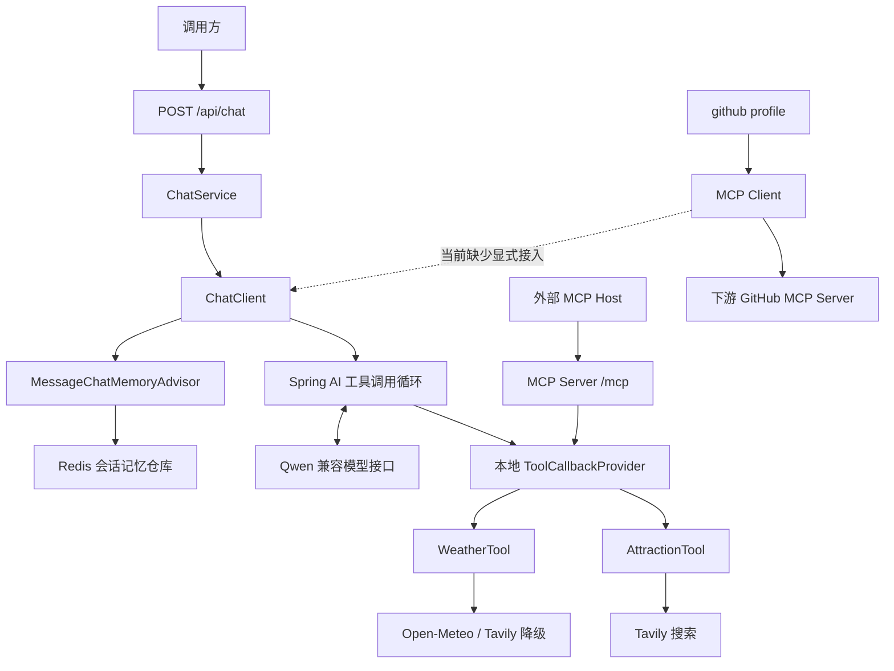
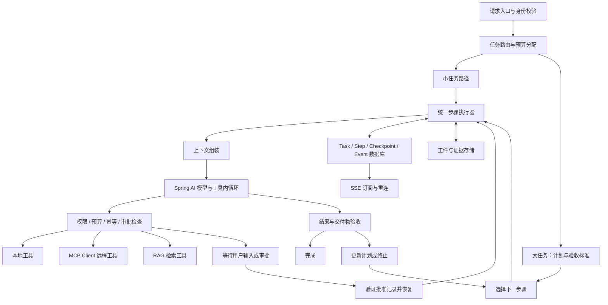

# Spring AI 项目评审与 Agent 演进方案

评审日期：2026-09-19。评审对象：当前工作区 `agentDemo1_0`，以实际存在的源码为准，不把 Git 中已删除的旧 Agent、压缩记忆等实现算作现有能力。

本文仅进行评审与设计，不修改应用代码、依赖、配置或既有文档。文中的目标架构、接口、预算和目录是后续实施建议，并非已经实现。

## 1. 先回答你的核心问题

**这个项目有助于学习 Spring AI，适合作为第一阶段的工具型对话应用；目前还不能承担你描述的完整 Agent。**

你已经接触到模型接入、`ChatClient`、Advisor、工具声明、会话记忆、流式接口、MCP Server。这些都是有价值的基础。当前代码规模也较小，适合观察一次请求究竟怎样流经框架。

真正需要调整的认识是：**把大量工具、Redis、向量库和 MCP 接到一起，并不会自动形成一个可靠处理大任务的 Agent。** 大任务需要明确目标、持久化执行状态、控制预算、验证结果、暂停恢复和管理副作用。Spring AI 可以承担模型与工具交互的基础部分；你还需要实现应用层的任务运行时。

最适合本项目的方向是：保留现有工具与 Spring AI 基础，在同一个执行底座上提供两条路径：

- 小任务：直接回答或进行少量工具调用，避免每个问题都先拆解成复杂计划。
- 大任务：先定义交付标准，再通过“规划—执行—检查—必要时重规划”完成，并允许跨请求、跨进程重启继续。

本文把“Agent 双循环”解释为**外层目标与计划循环 + 内层模型与工具循环**。这不是一个所有框架都统一定义的术语，也不意味着必须使用两个模型或两个 Agent。

## 2. 评审依据与验证边界

### 2.1 检查了什么

- `pom.xml`：Java 21、Spring Boot 4.1.1、Spring AI BOM 2.0.1、WebFlux、模型、Redis 记忆及 MCP 依赖。
- 全部当前 Java 主源码、三份测试类、`application.yml`、`system_prompt`。
- 既有 `docs/MCP-作用与改进计划.md`，以及 MCP 宿主配置中敏感字段是否为字面量；没有复制令牌值。
- 本机 Maven 缓存中的部分 Spring AI 2.0.1 配置元数据和可读取的类签名。
- 官方 Spring AI 参考文档。访问时其稳定版页面标识为 2.0.1，因此没有套用 1.0/1.1 教程判断当前 API。

### 2.2 没有把什么当成实测结果

本次没有启动应用，没有请求付费模型或 GitHub，没有重跑集成测试。当前命令环境能找到 Java，但 PATH 中未找到 Maven，项目也没有 Maven Wrapper；这不等于你在 IDE 中无法运行项目。

`target/surefire-reports` 留有 2026-09-16 的历史记录：共 5 个测试、0 失败、0 错误。**这是历史证据，不是本次对当前工作区的通过证明。** 当前已有较多暂存和未暂存改动，本次均保留。

本文使用三种结论：

| 标记 | 含义 |
|---|---|
| 已确认 | 可从当前源码、配置或与版本对应的官方 API 直接确认 |
| 待运行验证 | 存在明确触发条件，但未在本次运行环境中重现 |
| 能力缺口 | 为目标 Agent 必须增加的能力，不应简单视为入门 Demo 的 bug |

下文代码证据均以项目根目录下的路径和一基行号标注；源码改动后行号可能变化。

## 3. 目前实际实现了什么



| 目标能力 | 当前状态 | 判断 |
|---|---|---|
| 模型对话和流式输出 | 有 `ChatClient.stream().chatResponse()` 与 SSE | 已有基础 |
| 本地工具调用 | 天气、景点两个工具 | 已有基础 |
| 工具内循环 | 交给 Spring AI 2.0.1 默认机制 | 已有框架支持 |
| 多轮上下文 | `MessageChatMemoryAdvisor` + Redis 仓库 | 有限窗口记忆，不是长任务状态 |
| MCP Server | `/mcp`，Streamable HTTP，导出本地工具 | 有源码和历史协议测试 |
| MCP Client | 默认无下游；GitHub profile 配置 stdio 连接 | 连接配置存在，ChatClient 消费链路缺失 |
| 大量工具治理 | 固定注册两个工具 | 尚未实现 |
| 文档向量 RAG | 无入库、Embedding 配置、检索链路 | 尚未实现 |
| 长上下文管理 | 无 token 总预算、分层摘要、工件读取 | 尚未实现 |
| 外层计划与验收循环 | 无 Task、Plan、Step、Checkpoint | 尚未实现 |
| 人在回路 | 无审批记录、暂停状态、恢复接口 | 尚未实现 |
| 大任务恢复和取消 | 请求内 SSE，无独立任务运行时 | 尚未实现 |

注意：外部 Host 经 `/mcp` 调用天气工具，不经过本项目的 `/api/chat`、系统提示词和对话记忆。Host 负责自己的模型调用与上下文，MCP Server 提供工具服务。

## 4. 当前项目的问题与优先级

P0 表示应在共享或接入真实写操作前处理；P1 表示影响正确性或核心学习结论；P2 表示可维护性与后续演进问题。

### 4.1 P0：宿主示例配置残留明文凭据形式的值【已确认】

证据：`docs/mcp-host-config.json:11` 的 `GITHUB_PERSONAL_ACCESS_TOKEN` 字段存在符合 GitHub 令牌前缀的字面量。本文不复述该值，也没有测试其是否有效。

当前 Git 状态显示 `docs/` 尚未跟踪，但未跟踪文件仍可能被分享、备份或在之后整体提交。建议吊销并重建该令牌，宿主配置改用其真正支持的凭据注入方式，提交脱敏样例。

**纠正旧文档的一点：JSON 中写 `${GITHUB_PERSONAL_ACCESS_TOKEN:}` 不代表宿主会像 Spring 一样解析它；标准 JSON 也不支持普通注释。** 必须根据具体 Host 的配置机制处理，不应把 Spring 占位符语法机械复制过去。本次遵照要求没有修改配置或吊销凭据。

### 4.2 P0：会话默认值、碰撞和身份边界有问题【已确认】

证据：`ConversationKeys.java:16,30–49`，`ChatService.java:57,62`。

- 空 sessionId 都被映射到 `chat-default`。两个独立调用方都不传 ID，会读写同一个记忆键。
- 去空白与截断会合并不同输入，例如 `a b` 与 `ab`；超过 128 个保留字符、前缀相同的 ID 也会碰撞。
- 无用户归属校验。知道别人的 sessionId 就可能复用其记忆；“清洗字符串”不是鉴权。
- 服务端返回的是加过 `chat-` 的 conversationId，再把它原样作为 sessionId 传回，会变成 `chat-chat-...`。这是接口契约不明确造成的可触发断会话问题，并非已确认前端正在这样做。

建议由服务端生成不透明会话 ID；新建与继续会话使用明确契约。内部记忆键绑定可信身份，例如 `tenantId:userId:conversationId`，并校验归属。未登录的本地实验也应至少为每个新会话分配独立 ID。非法 ID 应拒绝，而不是静默改写成另一会话。

### 4.3 P0：工具入口缺少访问控制【已确认；影响取决于部署范围】

证据：`pom.xml` 无 Spring Security 依赖，当前 Controller 和 MCP 配置无鉴权；`WebConfig.java` 仅设置 CORS；`application.yml` 未限定监听地址。

CORS 不能阻止非浏览器调用。当前工具即便主要只读，也可能消耗 Tavily 配额；未来加入 GitHub 写入、文件操作后问题更严重。实际是否对其他机器开放，还取决于防火墙、代理和部署环境，本次未验证网络暴露范围。

学习阶段可限定本机访问；多人使用时引入认证、授权、配额与工具级执行策略。**本地可用工具与对外 MCP 工具可以复用实现，但不应被要求永远拥有相同权限和清单。**

### 4.4 P1：GitHub MCP 工具并未接入当前 ChatClient【已确认的装配缺口】

证据：`AiConfig.java:49–53,63–71` 只构造并传入本地 `agentToolCallbackProvider`；`application.yml:85–94` 仅在 GitHub profile 开启 MCP 回调并配置连接。

Spring AI 2.0.1 的 MCP Provider 不会自动加入 ChatClient，仍须显式接入。因此“下游握手成功”“容器产生了 MCP Provider”“模型请求带上了 GitHub 工具”是三件不同的事。旧文档 §3.3 对最后一件事作出了过强推断。[官方工具接入说明](https://docs.spring.io/spring-ai/reference/api/tools.html#mcp-tools)

建议分开命名本地 Provider 与远程 Provider，在消费侧明确组装允许使用的工具。测试要捕获真正发给模型的工具定义，再通过可控的模型响应验证远程工具执行，不能只检查 Spring Bean 是否存在。

对外 MCP Server 是否中继下游工具是另一项独立决策。**Agent 能消费 MCP，不要求它同时充当 MCP 聚合网关。** 暂时不做中继完全合理。

### 4.5 P1：会话记忆被赋予了超过其实际能力的期待【能力缺口】

证据：`AiConfig.java:69` 仅装配 `MessageChatMemoryAdvisor`；`application.yml:16–27` 配置 Redis 仓库及 7 天 TTL；没有自定义摘要、预算或任务状态类。

Redis 解决保存位置和寿命，滑动窗口决定选哪些消息，模型上下文窗口限制一次能读多少内容。三者不是一回事。默认 `MessageWindowChatMemory` 是消息数窗口，默认 20 条；这里的“条”不是 20 轮，也不是 token 数。Redis 适配器还要求 JSON 与搜索能力，不能只凭“6379 能连通”判断部署满足要求。[Chat Memory 官方说明](https://docs.spring.io/spring-ai/reference/api/chat-memory.html)

当前实现无法保证在几十轮后记住早期全部约束，也不能从 Redis 聊天记录自动恢复执行到一半的任务。TTL 到期更不应让一个仍在等待审批的大任务失去执行状态。

### 4.6 P1：缺少任务级预算，不能把提示词当执行约束【能力缺口】

证据：`system_prompt:10–12` 用自然语言要求按步骤和重试一次；`ChatService.java:36` 仅限制当前问题为 4000 字符。

**不要误报为“Spring AI 默认完全没有工具次数上限”。** 2.0.1 已提供每工具和每轮总调用限制，官方默认分别为 40 与 150；这不是本项目根据任务成本制定的预算。[工具次数限制](https://docs.spring.io/spring-ai/reference/api/tools.html#_tool_call_limits)

4000 字符也约束不了历史、工具定义、检索片段和工具大结果的总量。需要为 task、step 和单次模型请求设置总 token、时间、调用次数、费用、失败和重规划预算，并用程序强制执行。HTTP 自动重试、工具重试和外层重规划要共享预算，防止相乘。

### 4.7 P1：提示词要求输出“思考”，但服务端没有对应事件契约【已确认的不一致】

证据：`system_prompt:14–20`，`ChatService.java:59–68`，`ChatEventTypeEnum.java`。

提示词要求工具调用前输出“思考：”，又说它不属于最终答案；服务端只把收到的非空文本转成 DATA，没有独立的行动说明通道。该内容实际是否透传，取决于模型与框架流式行为，本次没有抓流验证。

不应依靠字符串前缀解析运行状态，也不需要模型输出完整内部推理。建议由执行器发布可验证事件：开始查询、工具名、完成、失败、等待审批。模型可以提供简短行动说明，但执行状态以真实工具事件为准。

### 4.8 P1：SSE 生命周期被当成任务生命周期【能力缺口及契约问题】

证据：`ChatService.java:70–80`，`ChatController.java:38–44`。

当前正常完成和部分响应式异常会追加 STOP，但以下说法不成立：

- 客户端取消、网络断开或进程退出后仍保证收到 STOP。
- 一定先有 SESSION_INFO：参数非法时实际直接返回 ERROR、STOP。
- 所有错误必定 HTTP 200：JSON 解码错误和某些流构造阶段同步异常不在该 `onErrorResume` 范围内。

对小型流式聊天，这些可以通过明确契约解决。对大任务，应先创建持久任务，由后台 Worker 执行，SSE 只订阅进度。断开订阅、请求停止、业务操作取消是三个不同动作。

### 4.9 P1：工具结果缺少证据结构，影响准确性与验证【已确认】

证据：`TavilySearcher.java:89–109` 优先返回 `answer`，兜底仅拼接 `results[].content`；未保留结果 URL、标题与时间。`OpenMeteoWeatherProvider.java:138–160` 最终只返回自然语言。

后果是模型难以给出可靠来源，大任务验收也无法核实“这个结论来自哪里”。搜索天气兜底与实况接口的数据新鲜度也不能被视为等价。天气 JSON 部分数值缺失时直接 `asDouble()`/`asInt()`，还可能把缺失误报成 0；地理编码只取首个结果，未处理同名城市。

建议工具返回结构化事实：`status / data / source / observedAt / retrievedAt / warnings / errorCode / retryable / artifactRef`。对缺失字段返回未知，城市不明确时请求澄清。先保证数据与来源，再由模型组织语言。

### 4.10 P1：同步工具与 WebFlux 的线程、超时边界需要实测【待运行验证】

证据：`TavilySearcher.java:81`、`OpenMeteoWeatherProvider.java:134` 使用 `.block(...)`。启动类却称应用为“全响应式”。

同步工具本身不必然错误，是否阻塞事件循环取决于实际调用调度；不能仅凭 `.block()` 宣称已经发生故障，也不能依据注释认定线程安全。需要分别验证本地聊天和 MCP 调用路径，观察实际线程、并发负载与取消行为。

天气最慢路径可以接近两次 10 秒 HTTP 等待再加 30 秒搜索降级，约 50 秒，尚未计入其他开销；测试注释估计的 40 秒不完整。若随后再搜景点，再加模型调用，一次请求可能远超单工具超时。

建议明确阻塞工具的受限执行池、每工具并发上限与总截止时间；不要简单把 `@Tool` 返回值换成 `Mono` 就认定问题已解决，应先核对该版本的工具适配契约。

### 4.11 P1：当前测试不能证明完整 Agent 链路正确【已确认】

现有测试值得保留，尤其 MCP 握手、列工具和调用测试。但存在以下边界：

| 当前测试 | 真正证明的内容 | 未证明的内容 |
|---|---|---|
| `contextLoads` | 测试环境能创建上下文 | 模型调用成功、记忆隔离 |
| `ToolRegistrationTest` | 被注入 Provider 包含两项工具 | 模型实际见到工具并执行；GitHub Provider 参与 |
| `McpServerIntegrationTest` | MCP Server 协议及天气调用路径 | `/api/chat`、景点工具、下游 MCP 消费、长任务恢复 |

协议测试还混入真实天气网络访问，可能受网络、限流和搜索密钥影响。建议将协议契约测试与真实外部服务冒烟测试分开：前者用确定性工具实现，后者显式启用。

### 4.12 P2：工具 Schema 与 Java 可空语义不一致【已确认】

证据：`AttractionTool.java:36,40–44` 写明 weather 可为空，也处理空值，但参数未标可选。`@ToolParam` 默认参数必填。[参数可选性说明](https://docs.spring.io/spring-ai/reference/api/tools.html#_json_schema)

后续应明确 weather 是否业务必需：必需则验证和先查天气；可选则在 Schema 声明可选。否则模型可能为满足必填而编造天气。`@ToolParam` 描述和运行时校验需要一致。

### 4.13 P2：日志、错误输出与模型元数据处理过于粗糙【已确认】

证据：`ChatController.java:41–42` 在 INFO 输出完整问题；`ChatService.java:79,95–98` 将异常消息回传；`TavilySearcher.java:76–78` 将上游错误体放入异常；`ChatService.java:66` 只保留文本。

建议对外返回稳定错误码和关联 ID，详细错误脱敏后内部记录。保留模型 usage、finish reason 与工具统计，以区分完整回答、预算终止、截断和失败。不能让所有“有正文然后 STOP”的结果都被认定为任务成功。

DEBUG 配置不等于已经泄露全部模型内容，但当前 Controller 记录原始问题是直接可见的事实。后续接入用户文档和内部知识时，应调整日志边界。

### 4.14 P2：GitHub MCP 依赖与工程复现性需要整理【已确认】

`application.yml:91` 通过 `npx -y` 启动未锁定版本的 `@modelcontextprotocol/server-github`。这一参考实现已归入归档仓库；应评估维护中的 GitHub 官方 MCP Server，并固定可复现的版本、权限和工具范围。[归档参考服务](https://github.com/modelcontextprotocol/servers-archived)；[GitHub 官方实现](https://github.com/github/github-mcp-server)

另外，POM 在 BOM 管理之外又给 MCP Server Starter 显式写了同一版本，当前不构成冲突，但未来升级容易漂移。项目缺少当前根目录运行指南、Wrapper 与明确的 Redis 能力说明；这些会降低学习实验的可复现性。

### 4.15 哪些不应该被错误批评

- `defaultTools(ToolCallbackProvider)` 在 2.0.1 中有效，不需要为了旧教程机械替换成旧 API。
- 没有自己写 `while` 循环不等于没有工具调用循环，2.0.1 有默认 `ToolCallingAdvisor`。
- `spring.ai.openai.chat.model`、`timeout` 和 `max-retries` 在已检查的 2.0.1 配置元数据中存在。不能套旧版路径判定无效，也不能套旧版 URL 拼接习惯断言当前 `/v1` 必然重复。[当前模型适配配置](https://docs.spring.io/spring-ai/reference/api/chat/openai-chat.html)
- 两个工具采用显式注册是合理选择；不必为扩展而做全容器反射扫描。
- MCP Server 只实现 tools、关闭未实现的 resources/prompts，并不是“不支持 MCP”。
- 出行场景选择没有问题；不足在于实验覆盖的能力有限，而不是天气工具本身没有学习价值。

## 5. 如何判断这个项目是否真正帮助你学习

### 5.1 已有学习价值

目前你能沿着一条较短的链路理解：用户消息如何到模型，模型为什么提出工具调用，工具如何产生 Schema，框架如何把结果再交给模型，以及同一工具怎样通过 MCP 暴露给其他应用。

`WeatherProvider` 的多数据源实现也有实际价值：可以区分“程序确定的容错流程”与“模型自行决定的行动”。不应把所有稳定业务步骤都交给模型推理。

### 5.2 最需要纠正的理解偏差

| 容易形成的认识 | 更准确的认识 |
|---|---|
| 引入 Starter 就算学会一项能力 | 要观察输入、输出、失败边界，并写能验证它的实验 |
| 使用自动配置看不到内部循环，所以不是真 Agent | 自动工具循环是有效机制；要学习它的事件、边界与控制点 |
| 工具越多越智能 | 工具质量、可发现性、权限和结果可靠性更关键 |
| Redis 记住所有内容，模型就拥有长上下文 | 保存、检索、上下文组装和模型容量是不同层 |
| RAG 就是装一个向量数据库 | RAG 还包括解析、切分、Embedding、检索、权限过滤、证据注入和评测 |
| Tavily 搜索等同于已实现向量 RAG | 它可以提供外部检索信息，但当前没有自己的文档向量检索闭环 |
| MCP 负责规划或多 Agent 协作 | MCP 提供连接与交互契约，目标管理和调度仍需应用实现 |
| 两个 while 或两个模型就是双循环 | 关键是目标层与动作层职责、状态和停止条件不同 |
| 提示词要求批准后再执行就是人在回路 | 执行入口必须受程序化审批状态约束，进程重启也不能绕过 |
| 向前端流式显示文本就是可观测的 Agent | 还需要工具、步骤、预算、审批和恢复事件 |
| 大任务只是输出更长 | 大任务通常有多个成果、依赖、外部副作用和跨时段执行 |

### 5.3 推荐的学习方法

每加入一项机制，至少回答四个问题：它接收什么？改变了什么？如何失败？如何证明它有效？

例如学习记忆时，用 30 轮对话验证最早的约束什么时候被丢弃；学习 MCP 时，分开验证握手、工具发现和模型调用；学习 RAG 时，准备带标准证据的问答集，比较没有检索、错误检索和正确检索的结果。这样的实验比继续添加十个相似工具更有学习收益。

## 6. 目标架构：Spring AI 底座 + 可恢复任务运行时

下面是针对本项目提出的设计，不是声称 Spring AI 已经提供同名业务组件。



### 6.1 职责边界

| 层 | 优先复用 Spring AI 的部分 | 应用需要负责的部分 |
|---|---|---|
| 模型访问 | `ChatClient`、模型适配、流式接口 | 模型选择、能力实测、全任务费用与时间预算 |
| 工具执行 | `@Tool`、`ToolCallback`、工具循环 | 权限、审批、幂等、副作用记录、任务级取消 |
| 上下文 | Advisor、ChatMemory 等接口 | 分层记忆、token 预算、摘要质量、工作集选择 |
| MCP | Client/Server 与协议适配 | 信任边界、工具范围、身份映射、下游故障策略 |
| RAG | Document、EmbeddingModel、VectorStore、RAG Advisor | 文档治理、版本、访问控制、引用与评测 |
| 长任务 | 可组合的模型与工具基础能力 | Task/Plan/Step 状态机、检查点、恢复、验收 |

建议先采用模块化单体：一个 Spring Boot 服务、一个 Worker 模块、一个关系数据库，加现有 Redis。无需立即拆微服务或上多 Agent。

若后续确实需要跨服务长时间工作流，再评估持久化工作流或图执行方案。必须分别核对项目来源、兼容版本和恢复语义，不把第三方 Agent 框架、Spring AI Alibaba 与 Spring AI 核心当成同一个项目。

## 7. 大量工具：建立目录与选择机制

### 7.1 将“拥有”与“当前可用”分开

建议维护应用级 ToolCatalog，每项至少包含：稳定 ID、模型可见名称、用途、输入输出 Schema、来源、版本、只读/写入属性、权限、审批策略、超时、并发限制、是否可重试、幂等能力。

处理请求时执行：

1. 根据可信用户身份过滤不可用工具。
2. 按任务领域和步骤检索候选工具。
3. 给模型提供少量相关定义，按需要再发现更多工具。
4. 执行前再次验证权限、参数、预算和审批。
5. 对结果设置大小上限，长结果转工件引用。

检索排序不能替代授权。动态工具目录变化时应刷新缓存；工具名称加来源命名空间，并检查重复。不要把管理工具和所有 MCP 工具先设置成全局默认，再误以为每请求只传少数工具就完成了隔离。

### 7.2 复用 2.0.1 已有工具搜索能力

该版本提供 `ToolSearchToolCallingAdvisor`，可通过 `spring-ai-starter-tool-search-advisor` 接入，支持关键字/语义等索引选择。它是工具目录扩大后的候选方案；当前只有两个工具无需立即引入。它负责发现，应用仍负责授权与审批。[工具搜索官方说明](https://docs.spring.io/spring-ai/reference/api/tools/tool-search-tool.html)

为本项目建议先从 10–20 个职责清晰的工具做评测，再扩展目录。假设每个工具定义平均占 250 token，200 个工具就是约 50,000 token；这只是容量估算，用于说明全量发送的成本，实际值需测量。

### 7.3 工具设计应能验证结果

比起宽泛的 `doAnything(instruction)`，优先定义可独立测试的动作，如 `searchDocuments`、`readDocumentSection`、`createDraft`、`publishApprovedDraft`。读和写分离，参数有清晰边界；即使业务上只有一个入口，执行层也必须识别其副作用。

统一结果建议：

```text
ToolResult
  status: SUCCESS | EMPTY | RETRYABLE_ERROR | PERMANENT_ERROR
  data: 小型结构化数据
  evidence: 来源、版本、时间、可访问引用
  artifactRef: 大结果的存储引用
  warnings: 缺失、降级与不确定信息
  errorCode / retryable
  executionId / duration
```

这是应用协议建议。MCP 的返回格式仍通过适配器映射，不能假设所有外部服务天然采用该结构。

## 8. 长上下文：控制每次模型实际看到的工作集

### 8.1 至少区分五种状态

| 状态 | 内容 | 存储建议 |
|---|---|---|
| 最近对话 | 当前问题与近期交流 | 有界 ChatMemory，现有 Redis 可继续用 |
| 稳定约束 | 用户明确偏好、禁区、预算、已经确认的决定 | 结构化记录，带来源、时间和适用范围 |
| 任务状态 | 目标、计划、进度、待审批动作、验收结果 | 关系数据库，独立于聊天 TTL |
| 证据知识 | 文档、检索片段、历史成果 | 原文存储 + 检索索引 |
| 大型工件 | 报告、原始搜索结果、长日志、文件 | 文件或对象存储，按需分页/分节读取 |

最终 Prompt 由 ContextAssembler 按任务需要组装，而不是把全部记录串起来。

### 8.2 按 token 预算管理

设模型实际允许上下文为 C，则每次调用应满足：

```text
系统指令 + 当前输入 + 工具定义 + 最近对话 + 任务摘要
+ 本步证据 + 当前工具结果 + 输出预留 + 安全余量 <= C
```

示例：假设实测可使用 32k token，预留输出 6k、安全余量 2k，则所有输入最多约 24k。这个示例不代表当前 `qwen-turbo` 的真实限制。模型版本、兼容接口和工具调用能力需要单独核实。

字符数只能做请求体防护，不能替代 token 计量。采用与供应商匹配的计量方式；无法精确时保守估算，并记录实际 usage 校正。

### 8.3 压缩规则

- 优先移走冗长工具结果，保留结论、来源与工件引用；通过分页读取拿回细节。
- 历史摘要按结构保存：目标、约束、已完成项、关键证据、未解决问题、用户决定。
- 关键数字、用户原话约束和审批动作保持可追溯原文，不能仅依赖反复生成的摘要。
- 工具调用与结果保持匹配，不能裁剪出孤立的 call ID 或 tool response。
- 每次摘要附来源范围与版本；修改目标时失效旧摘要，避免过时约束继续生效。
- 外部文档与搜索内容作为数据，不允许其中的指令改变工具权限、审批规则或系统目标。

压缩降低信息体积，也可能丢失事实，因此需要专门评测。向量检索可补充找回，但不保证总能召回被删细节。

## 9. RAG：建立可追溯的知识检索闭环

### 9.1 本项目建议的第一版

先做“Spring AI 2.0.1 学习资料助手”：导入少量官方资料与项目说明，回答 API 用法时显示来源和版本。它直接服务于你的学习目标，也容易判断答案是否正确。

建议先选择 PostgreSQL + pgvector，让任务表和向量索引共用一套数据库运维，但使用独立表与访问边界。现有 Redis 留作对话记忆。Spring AI 提供 pgvector 适配，但数据库扩展、索引与维度仍需正确配置。[pgvector 适配说明](https://docs.spring.io/spring-ai/reference/api/vectordbs/pgvector.html)

也可以使用 Redis 向量索引以减少基础设施种类，但必须明确：**当前 Redis ChatMemory 仓库不是 VectorStore，装了记忆 Starter 不等于完成了 RAG。**

### 9.2 入库流程

```text
授权获取文档 → 解析 → 保留标题/章节/代码块
→ 分块 → 加元数据 → Embedding → 写入 VectorStore
→ 保存原文、文档版本和分块对应关系
```

Spring AI 的 ETL 接口可用于解析与转换基础链路，具体清洗规则由业务决定。[ETL 官方文档](https://docs.spring.io/spring-ai/reference/api/etl-pipeline.html)

建议元数据至少包含 `documentId / chunkId / source / version / section / tenantId / acl / updatedAt / contentHash / embeddingModel`。对同一文档更新时识别内容变化、删除失效块；删除授权或文档时同步清理索引。

Embedding 模型应单独配置和验证，不能让聊天模型名称隐式承担向量化。建库维度、相似度方式、Embedding 模型版本应保持匹配，更换模型通常需要重新构建索引。

### 9.3 查询流程

```text
明确当前问题 → 必要时结合对话改写查询
→ 在可信权限范围内检索 → 可选重排 → 去重与预算裁剪
→ 注入有来源的证据 → 生成答案 → 校验引用能对应证据
```

初期选一个 RAG 接入方式：简单问答可用 `QuestionAnswerAdvisor`，需要模块化处理时用 `RetrievalAugmentationAdvisor`；2.0 对应模块分别是 `spring-ai-vector-store-advisor` 与 `spring-ai-rag`。[RAG 官方文档](https://docs.spring.io/spring-ai/reference/api/retrieval-augmented-generation.html)

对通用 Agent，建议把知识检索也暴露为只读工具，只有需要资料时才调用。固定问答接口使用 Advisor、规划步骤使用检索工具都可以；避免两者无意重复检索同一问题。

权限过滤必须由后端可信身份产生，不能让模型自行提供 tenantId 决定可读范围。检索为空时明确证据不足；如果另行使用模型常识，应标明其不是知识库结论。

### 9.4 评测不只看答案“像不像”

准备至少 20 条有标准证据的题目，覆盖：可回答、不可回答、多文档、同名 API 不同版本、用户无权读取、旧文档被替换、文档中有恶意指令。记录召回命中、引用正确性、拒答合理性、延迟和费用。

文档知识索引、工具发现索引、用户记忆索引即便共享物理数据库，也应逻辑隔离，不能混作一个无差别的向量集合。

## 10. Agent 双循环：目标层负责完成，动作层负责执行

### 10.1 内循环

```text
组装本步上下文 → 调用模型 → 若需工具则校验并执行
→ 写回结果 → 再次调用模型 → 返回本步结果或受控终止
```

小任务可继续使用 Spring AI 的 `ToolCallingAdvisor`。2.0.1 默认在循环内部维护工具交互历史；默认外侧记忆 Advisor 主要保存最终用户/助手交换，因此聊天仓库不能直接当执行审计库。自定义时要明确 Advisor 顺序，而且一个链路只能有一个负责工具循环的 ToolAdvisor。[工具循环官方说明](https://docs.spring.io/spring-ai/reference/api/tools/tool-calling-advisor.html)

### 10.2 外循环

```text
确定目标与验收标准
→ 生成结构化计划
→ 选择满足依赖的一步
→ 调用内循环执行
→ 验证证据和交付物
→ 成功则推进；失败则有限重试、重规划或请求输入
→ 所有验收条件满足后完成
```

每一步计划建议包含 `stepId / objective / dependencies / allowedCapabilities / expectedArtifacts / acceptanceCriteria / budget`。计划经服务端 Schema 与业务校验后再接受，不能把一段自然语言列表直接当可靠调度状态。

外循环必须独立判断：文件是否实际生成、引用是否存在、预算是否满足、必要审批是否完成。模型说“已经完成”只是候选结论。

### 10.3 什么时候使用自动循环，什么时候自己控制

| 场景 | 建议 |
|---|---|
| 天气查询、少量只读工具 | 默认工具循环，加明确预算和事件观察 |
| 一个步骤内部工具较多，但不跨时段暂停 | 在框架支持的控制点增加治理和观测 |
| 需要人审批后数小时再执行、进程重启后续跑 | 持久化步骤执行器控制待执行动作和模型交互状态 |

长任务可以在动作边界选择用户控制的工具执行方式：先得到模型提议，记录调用，再批准执行。此时关闭该调用路径的自动工具循环，避免同一动作被框架和自定义执行器各执行一次。仍然复用 Spring AI 的模型、消息、Schema 和工具执行基础设施。

**不要在默认完整工具循环外再套一个“为了保险继续问模型”的无限 while。** 外循环每次推进必须依据任务状态和验收结果，而不是因为还有 token 就继续运行。

### 10.4 任务预算示例

以下是初始实验参数，不是框架默认值或已验证性能指标：

| 路径 | 工具调用预算 | 重规划 | 运行方式 |
|---|---|---|---|
| 简单问答 | 0 | 0 | 请求内完成 |
| 天气与景点 | 最多 4 次工具调用，另设模型与时间预算 | 通常不需要 | 可请求内完成 |
| 多资料报告 | 每步骤最多 6 次工具调用，全任务另设总上限 | 最多 2 次 | 持久任务与后台 Worker |

同时设置绝对截止时间、总 token/费用上限和重复调用检测。“相同参数反复调用但没有新证据”应触发停止或求助。只读查询可有限退避重试；有副作用的动作先检查幂等和外部状态。

## 11. 人在回路：持久化暂停、批准和恢复

### 11.1 哪些点需要人参与

建议只在任务确有需要时触发：缺少关键输入、用户要求检查中间结果、危险或有外部副作用的动作、超出授权预算、证据冲突无法自动解决。不要让每一次普通只读查询都弹确认。

MCP 的用户交互能力可以帮助向 Host 请求信息，但不会自动替应用实现可靠审批。协议层的交互与业务审批状态应明确区分。[MCP 工具规范](https://modelcontextprotocol.io/specification/2025-11-25/server/tools)

### 11.2 审批对象必须是具体动作

```text
ApprovalRequest
  approvalId / taskId / stepId / ownerId
  toolId / toolVersion
  normalizedArguments / argumentsHash
  preview / sideEffectDescription
  expectedResourceVersion
  expiresAt
  status: PENDING | APPROVED | REJECTED | EXPIRED
```

例如用户批准的是“把这段内容写入某仓库的某个分支路径”，就不能恢复后让模型换一个目标文件或重新生成不同内容，却继续复用旧批准。

### 11.3 推荐执行顺序

1. 模型提出具体动作，程序校验参数、权限与风险。
2. 将待执行调用、检查点和审批请求持久化，任务进入 `WAITING_APPROVAL`。
3. 释放 Worker，不占着一个 HTTP 请求或线程等待数小时。
4. 用户查看预览并批准、拒绝或修改；审批接口检查用户身份与任务归属。
5. 恢复时校验批准未过期、参数哈希和目标资源版本一致；变更则重新生成审批。
6. 通过幂等键执行，保存结果后继续内循环或推进计划。

普通用户消息中出现“已批准”不能绕过审批接口。审批是可审计的状态迁移，不是模型输出里的一句话。

### 11.4 崩溃与副作用

外部写入成功、但本地来不及记成功就崩溃，是最关键的恢复场景。不要笼统承诺 exactly-once：应使用持久执行意图、稳定幂等键、外部操作 ID 与状态查询。

下游不支持幂等、也不能确认是否成功时，标记 `UNKNOWN` 并等待核对，不盲目重放。一个模型响应中包含多次调用时，逐项保存结果，恢复时只处理尚未执行且获批的项。

## 12. 同时支持小任务与大任务

### 12.1 路由依据

任务大小不能仅按用户输入字数判断。路由需要考虑：是否有明确交付物、是否多阶段依赖、是否要读大量资料、是否包含外部写入、预计时间、是否可能等待用户。

优先采用简单规则，再用模型辅助分类；允许用户指定模式。分类错误时可升级任务路径，但必须携带已完成结果和执行记录，避免重复付费或重复写入。

### 12.2 两个贯穿式案例

**小任务：“杭州现在天气怎样，推荐两个适合去的地方。”**

直接进入有界执行器 → 查询天气 → 景点检索 → 组织带来源与数据时间的回答。天气失败时说明限制，不把搜索兜底包装成确定实况。不需要专门生成长计划，也不必无理由访问知识库。

**大任务：“结合知识库中的旅行偏好和预算，规划三城七日行程，比较方案，生成文档，经我确认后写入指定仓库。”**

先确认日期、人数和交付要求 → RAG 检索已授权偏好 → 分步骤收集交通、天气与景点证据 → 对独立只读查询受限并行 → 计算预算和行程可行性 → 生成报告草稿 → 程序检查费用、日期与来源 → 用户检查具体写入预览 → 批准后执行仓库写入 → 保存外部操作 ID → 验收完成。

当前两个工具不足以完整完成第二个案例；这正是后续补充领域能力的依据，而不是让模型凭空填补交通与费用数据。处理中断后应能从数据库恢复，用户关闭页面不应消灭任务。

## 13. 建议的数据模型、接口与模块

### 13.1 最小持久化实体

| 实体 | 关键字段与作用 |
|---|---|
| Task | 归属、目标、状态、总预算、截止时间、状态版本 |
| Plan / Step | 计划版本、依赖、验收条件、输入输出工件引用 |
| ToolExecution | 调用 ID、参数摘要、状态、幂等键、外部操作 ID、错误 |
| Checkpoint | 步骤位置、待处理调用、必要消息、上下文引用、版本 |
| Approval | 具体动作、批准人、有效期、参数哈希、决定 |
| Artifact | 存储位置、内容哈希、来源、访问控制 |
| TaskEvent | 递增序号、事件类型、关联实体、可公开的事件数据 |

并发 Worker 通过数据库状态版本或租约竞争执行权；同一会话多个请求要串行化或定义并发语义，不能假设聊天仓库自动解决顺序问题。权限、凭据不让模型产生，恢复状态也不保存不必要的明文密钥。

### 13.2 状态和 API 草案

```text
Task:
CREATED → RUNNING → COMPLETED
                → WAITING_INPUT / WAITING_APPROVAL → RUNNING
                → FAILED / CANCELLED / BUDGET_EXCEEDED

POST /api/tasks                     创建并返回 taskId
GET  /api/tasks/{id}                 查询快照
GET  /api/tasks/{id}/events          SSE；使用持久事件序号重连
POST /api/tasks/{id}/input           补充输入
POST /api/tasks/{id}/approvals/{aid}  提交审批决定
POST /api/tasks/{id}/cancel          请求取消
GET  /api/tasks/{id}/artifacts        查询交付物
```

以上为建议接口，不是当前已存在的端点。原 `/api/chat` 可保留作为快捷聊天入口，内部逐渐复用执行服务。

建议事件包括 `TASK_STARTED / STEP_STARTED / TOOL_STARTED / TOOL_COMPLETED / APPROVAL_REQUIRED / ARTIFACT_READY / ANSWER_DELTA / TASK_COMPLETED / TASK_FAILED`。事件应可排序、去重、重放；面向用户的内容不包含完整内部推理或敏感工具参数。

### 13.3 模块划分建议

```text
api          聊天、任务、审批和事件入口
agent        TaskRouter、Planner、StepExecutor、Verifier
context      ContextAssembler、预算、摘要、证据选择
tools        目录、策略、执行记录、本地工具
mcp          远程工具适配与可选对外导出
rag          文档入库、检索、引用与评测
workflow     状态机、检查点、恢复、取消
approval     审批规则与状态迁移
storage      任务、工件与事件持久化
evaluation   确定性契约测试和模型行为评测
```

不要先建一套空目录框架。每个阶段只引入当前实验真正需要的模块。

## 14. 实施路线：每一步都能验收

### 阶段 A：把当前 Demo 变成可信的学习基线

处理凭据、会话 ID、Schema、错误与日志问题；显式接入 MCP 客户端工具；补运行指南和可复现开发配置。保留现有两个工具，不急于扩展数量。

验收：两个用户、两个会话不串记忆；返回的会话标识可继续使用；默认请求仅有本地工具；GitHub profile 的模型请求能看到获准远程工具；失败、取消和非法输入行为有明确契约。

### 阶段 B：把工具循环变成可观察、可控制的实验

为模型调用、工具执行和失败建立事件，调整符合小任务的预算，用确定性模拟模型验证工具循环，再用少量真实模型案例冒烟。

验收：普通问题不调用工具；有依赖的调用按结果推进；达到预算明确终止；重复调用可识别；不能靠模型声称成功掩盖失败。观察 Advisor 在循环内外的位置对调用次数和记忆的影响。

### 阶段 C：实现最小向量 RAG

导入一组版本明确的 Spring AI 文档，配置独立 Embedding 与 VectorStore，提供来源引用，建立评测题集。

验收：能定位正确版本资料；无证据时说明未知；用户读不到未授权文档；更新或删除文档后旧知识可失效。

### 阶段 D：补上下文管理和工具目录

引入 token 预算、结构化摘要、工件引用、工具候选选择；比较全量工具与动态发现的准确性和成本。

验收：长工具输出不会挤爆输入；30 轮对话后关键用户约束仍可恢复；工具数量增加后记录选错率与额外发现延迟，而不是只统计“注册了多少个”。

### 阶段 E：实现持久任务外循环

加入 Task/Step/Checkpoint、Worker、计划与验收。先串行完成三个有依赖步骤，再考虑并行。

验收：完成两步后停止进程，重启能从下一步继续；缺少交付物不能完成；外层重规划有上限；SSE 重连可重放进度。

### 阶段 F：加入人在回路和有副作用工具

使用一个可控测试写操作练习预览、审批、拒绝、过期、取消、幂等和未知结果处理。

验收：未批准绝不执行；批准后改参数必须重新批准；重复提交审批不会重复写入；等待期间重启不丢状态；外部成功但本地失败能通过幂等或核对恢复。

### 阶段 G：扩展容量与领域

再加入多个 MCP Server、更多工具、受限并行、模型路由与更全面评测。只有单个执行器的状态与权限边界稳定后，才考虑多个专业 Agent 协作；多个 Agent 会增加上下文传递、协调成本和失败面。

## 15. 建议优先建立的验收清单

| 类别 | 测试场景 | 通过条件 |
|---|---|---|
| 会话 | 两人不传 ID；ID 清洗碰撞；原样回传服务端 ID | 独立会话、无越权、可稳定续聊 |
| 工具 | 模拟模型连续两次工具调用 | 名称、参数、执行次数与结果匹配 |
| MCP | 下游发现成功但未绑定 ChatClient | 测试能捕获工具不可见，而不是误报通过 |
| 异常 | 网络超时、参数错误、半途流失败 | 稳定错误与结束语义，保留执行事实 |
| 上下文 | 大结果、多轮历史、超预算 | 受控裁剪，关键事实可追溯 |
| RAG | 无答案、版本冲突、越权、文档更新 | 引用可靠、权限有效、旧块失效 |
| 循环 | 不断提出重复工具调用 | 在应用预算内终止并说明原因 |
| 长任务 | Worker 崩溃、SSE 断开、多 Worker 抢占 | 状态可恢复，不重复执行已完成步骤 |
| 审批 | 拒绝、过期、参数变更、重复提交 | 执行受具体有效批准约束 |
| 副作用 | 外部成功后进程崩溃 | 幂等恢复或明确 UNKNOWN，不盲目重试 |

确定性契约测试用于证明代码和状态机；真实模型评测用于测量选择工具、检索与规划质量。两者都需要，不能要求一次模型回答完全一样才算正确，也不能用“模型具有随机性”解释状态机错误。

## 16. 官方资料与阅读顺序

下列来源在本次评审中核对过。官方 `reference` 路径会随稳定版本更新；后续升级时应重新核对版本，不把本文的 2.0.1 结论无条件应用于其他版本。

1. [Spring AI Tool Calling](https://docs.spring.io/spring-ai/reference/api/tools.html)：先理解工具定义、显式接入、参数与调用限制。
2. [ToolCallingAdvisor](https://docs.spring.io/spring-ai/reference/api/tools/tool-calling-advisor.html)：理解循环归属和自定义控制点。
3. [Chat Memory](https://docs.spring.io/spring-ai/reference/api/chat-memory.html)：区分存储、窗口和会话隔离。
4. [MCP Client Starter](https://docs.spring.io/spring-ai/reference/api/mcp/mcp-client-boot-starter-docs.html)：区分连接、Provider 和应用消费。
5. [MCP Tools 规范](https://modelcontextprotocol.io/specification/2025-11-25/server/tools)：理解协议工具契约与交互边界。
6. [RAG](https://docs.spring.io/spring-ai/reference/api/retrieval-augmented-generation.html)、[ETL](https://docs.spring.io/spring-ai/reference/api/etl-pipeline.html)、[pgvector](https://docs.spring.io/spring-ai/reference/api/vectordbs/pgvector.html)：完成知识入库到答案引用的闭环。
7. [Tool Search](https://docs.spring.io/spring-ai/reference/api/tools/tool-search-tool.html)：在已有测量显示需要时引入动态发现。
8. [2.0 升级说明](https://docs.spring.io/spring-ai/reference/upgrade-notes.html)：避免把旧教程里的名称和配置误用到本项目。

建议下一次实际开发从阶段 A 开始，随后用一个小任务贯穿工具事件、RAG 和预算，再用一个三步骤任务练习恢复与审批。每个阶段保留一套可重复运行的实验，逐步把这个项目从“能回答问题的 Demo”发展为“执行过程可检查、可控制、可恢复的 Agent”。
